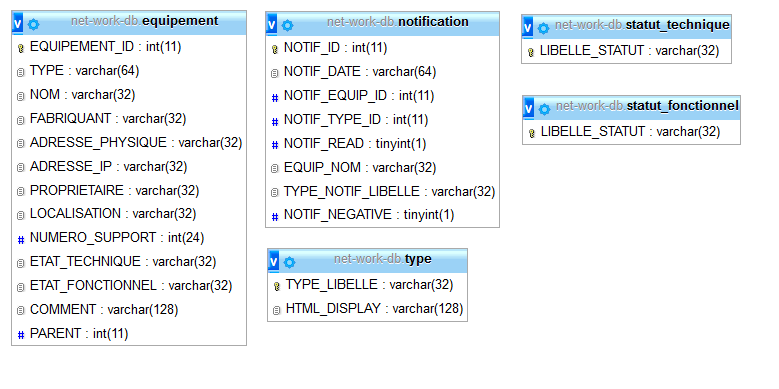
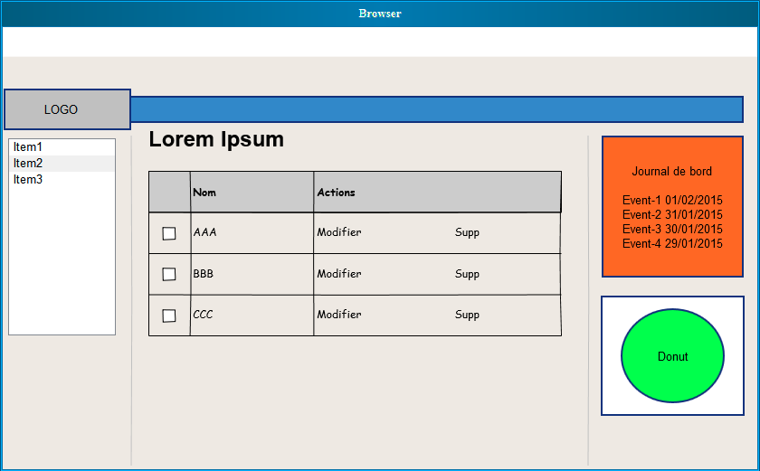
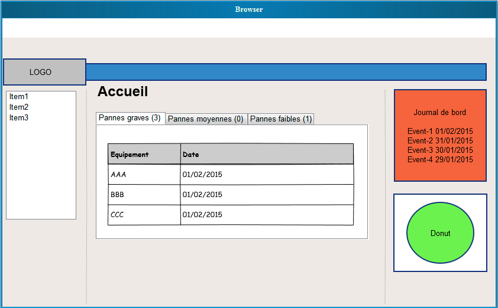
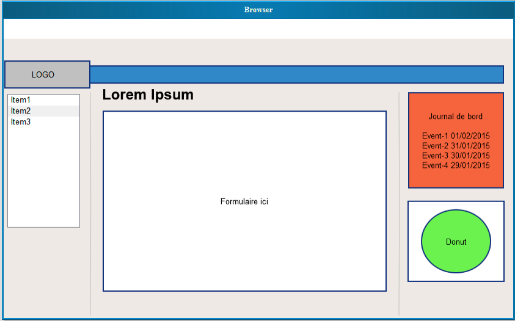

#Phase 2 : Architecture de la base de données et conception de l'interface d'administration

##1. Architecture de la base de données

###1.1. Vue générale de la base de données 

###1.2. Remarques
Expliquer que les équipements ne peuvent avoir qu'un parent pour simplifier la conception de la base de données.

##2. Conception de l'interface d'adminstration
###2.1.Vue de la page d'accueil 

###2.2.Vue de la liste des équipements 

###2.3.Vue du formulaire d'ajout des équipements 
